<p align="center"></p>
<p align="center"></p>


<p align="center">
    <a style="text-decoration:none !important;" href="http://arxiv.org/abs/2101.02703" alt="arXiv">  </a>
    <a style="text-decoration:none !important;" href="https://people.eecs.berkeley.edu/%7Eangelopoulos/blog/posts/rcps/" alt="website">  </a>
    <a style="text-decoration:none !important;" href="https://docs.conda.io/en/latest/miniconda.html" alt="package management">  </a>
    <a style="text-decoration:none !important;" href="https://opensource.org/licenses/MIT" alt="License">  </a>
    <a style="text-decoration:none !important;" href="https://twitter.com/ml_angelopoulos?ref_src=twsrc%5Etfw" alt="package management">  </a>

</p>

## Paper 
[Distribution-Free, Risk-Controlling Prediction Sets](http://arxiv.org/abs/2101.02703)
```
@article{bates-rcps,
  title={Distribution-Free, Risk-Controlling Prediction Sets},
  author={Bates, Stephen and Angelopoulos, Anastasios N and Lei, Lihua and Malik, Jitendra and Jordan, Michael I},
  journal={arXiv preprint arXiv:2101.02703},
  year={2020}
}
```

## Basic Overview
<p>
  For general information about RCPS, you can check <a href="https://people.eecs.berkeley.edu/%7Eangelopoulos/blog/posts/rcps/">our blog post</a>.
  This GitHub contains the code we used for the experiments in the RCPS paper.
  Each experiment lives in a different, appropriately named folder.
  The directory <code>core</code> contains code common to all of our experiments, including the implementations of concentration bounds and choice of lambda hat.
  <b> The repository is still a work in progress</b>; we will be continually updating the code to make it more user-friendly and remove clutter from our development.
  If you have trouble reproducing our results, please email <code>angelopoulos@berkeley.edu</code>.
</p>

## Getting Started 
<p>
  We store some large files in our git repo via <code>git-lfs</code>; you may need to install and configure it from <a href="https://git-lfs.github.com/">here</a>.  
  After installing <code>git-lfs</code>, you can clone this repository. 
  Then, you can create the <code>rcps</code> conda environment by running the following line: 
</p>

```
conda create --name rcps --file ./requirements.txt 
```

<p>
  Each experiment requires different datasets. 
  For the <code>./imagenet</code> and <code>./hierarchical_imagenet</code> experiments, you will need to point the scripts towards the val directory of your local copy of the Imagenet dataset.
  Similarly, for <code>./coco</code>, you need to point the scripts towards your local copy of the 2017 version of MS COCO, available <a href="https://cocodataset.org/#download">here</a>.
  For the <code>./polyp</code> and <code>./protein</code> examples, a bit more work must be done.
</p>

### Polyp data
<p>
  We used data from five different datasets: <a href="https://datasets.simula.no/hyper-kvasir/">HyperKvasir-SEG</a>, <a href="https://polyp.grand-challenge.org/CVCClinicDB/">CVC-ClinicDB</a>, <a href="https://datasets.simula.no/kvasir/">Kvasir-SEG</a>, <a href="http://www.cvc.uab.es/CVC-Colon/index.php/databases/">CVC-ColonDB</a>, and <a href="https://polyp.grand-challenge.org/EtisLarib/">ETIS-LaribPolypDB</a>. 
  Download each of these datasets and unzip them into the folder <code>./polyps/PraNet/data/TestDataset/{datasetname}</code>.
  Then run the script <code>./polyps/PraNet/process_all_data.py</code>, which should store the outputs of the tumor prediction model in the proper directory so you can run our experiments.
</p>

### Protein data 
<p>
  For the AlphaFoldv1 experiments in <code>./proteins</code>, you can point the scripts to the alphafold CASP-13 test set, available <a href="http://bit.ly/alphafold-casp13-data">here</a>. 
</p>

## License
<a href="https://opensource.org/licenses/MIT" alt="License">MIT License</a>
